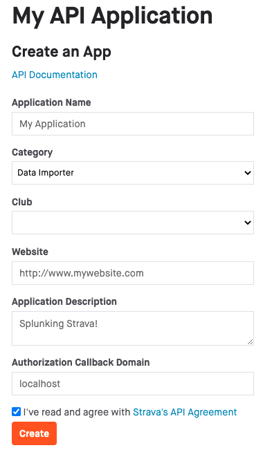
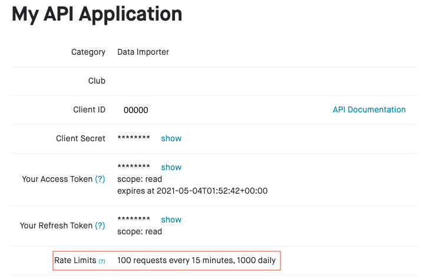

If you haven't done so, first you will have to create an app on Strava. This allows Splunk to interact with the Strava API.

**Steps**

1. Go to <https://www.strava.com/settings/api>.
2. Create an application, use details that are relevant to you. If you're hosting this app for use by others, you might want to use your own domain for the `Authorization Callback Domain`, if it's for personal or family use you can stick with `localhost` like in the example below.

    

3. Click `Create` and add an icon.
4. Once you've created the app, you'll see the details on the next page. The `Client ID` is the ID of your app and can be shared with others in case you want to collect their data as well (more about that in the next step), the `Client Secret` is required for Splunk to get the data but outside of that it should never be shared with anyone. Make note of the rate limit, which you most likely hit the first time you start importing all your activities which might cause initial download of the activities to be slow.

    

5. With the Strava API Application created you're all set. Keep this tab open as we need the `Client ID` and `Client Secret`, now head over to Splunk and install the Strava Add-On for Splunk there.