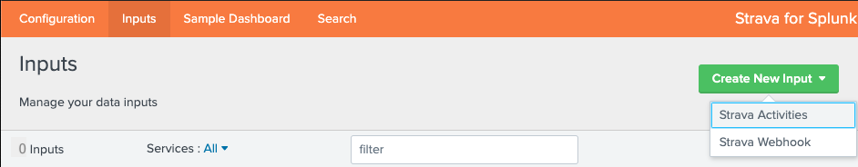
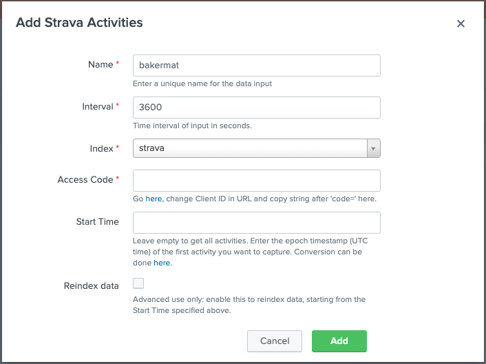

Next add the Strava athlete whose activities need to be retrieved. In the **Inputs** tab, click on `Create New Input` -> `Strava Activities`.

> **_NOTE:_**  Strava Athlete is probably a more accurate definition of the input, as you would have to create one input per athlete you want to add.

Add the details of the athlete you want to add.

- **Name**: Name of the input, which will be reflected in the event source (e.g. `strava_api://bakermat` in the example above).
- **Interval**: Interval (in seconds) in which the Strava API is being queried for new data, in this example every hour.
- **Index**: Index that data is sent to.
- **Access Code**: Each athlete will have their own access code, which ties the app you created in Getting Started to this athlete. To get that access code, make sure the athlete whose activities you want to capture, goes to <https://www.strava.com/oauth/authorize?client_id=[client_id]&redirect_uri=http://localhost&response_type=code&scope=activity:read_all,profile:read_all>. Make sure to replace `[client_id]` with the `Client ID` for your app as created in the [Getting Started](../getting-started.md) section. They will have to click on `Authorize` in the pop-up.
- **Start Time**: (Optional) If you don't want to index all activities but only activities from a certain date onwards, put in the epoch timestamp here. You can get the timestamp from [epochconverter.com](https://www.epochconverter.com/) for example.
- **Reindex Data**: (Optional) If you want to reindex this athlete's activities, tick this box. If `Start Time` is left, all data will be retrieved. Use with caution, as it might result in duplicate events.