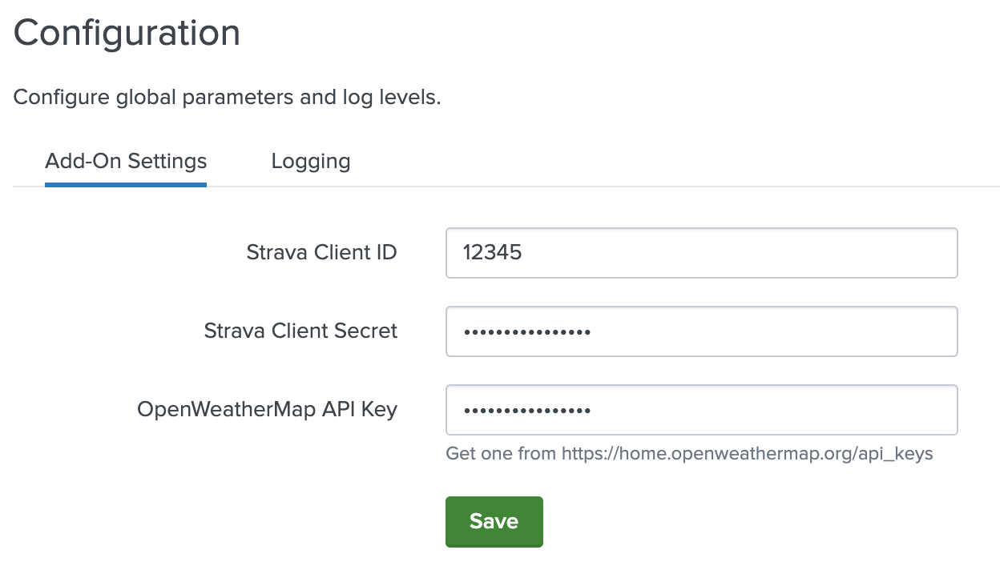

Once the Strava Add-On for Splunk is installed, open it. First we have to setup a 'global' parameter, which only has to be done once. In the fields here, use the `Client ID` and `Client Secret` settings from the [Strava API Application page](https://www.strava.com/settings/api) so the app can authenticate with Strava.

If you want to leverage weather information from OpenWeatherMap, fill in your [OpenWeatherMap API key](https://home.openweathermap.org/api_keys) here.

In the **Logging** tab, you can select the level of logging. This is set to `INFO` by default and only needs to be changed in case of troubleshooting and more verbose logs are desired.