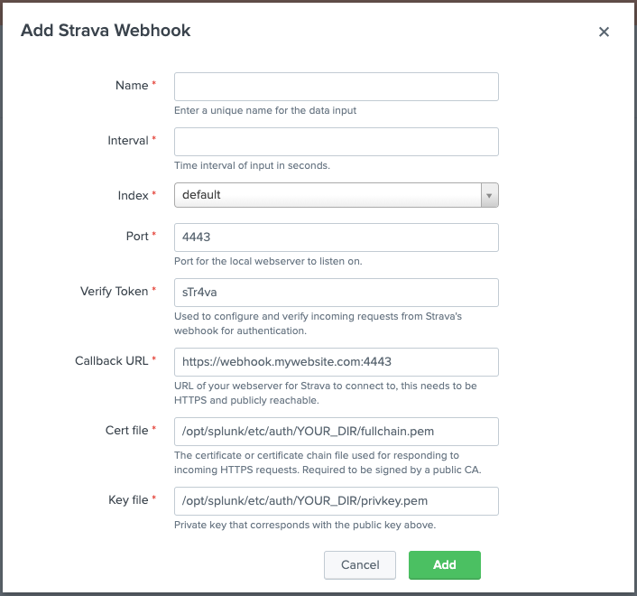

If you have multiple users, you might hit Strava's API rate limits. If this happens regularly, it might be worthwhile setting up a webhook. That way every time an athlete uploads an activity to Strava, the webhook gets notified and immediately retrieves the activity instead of having to wait till the next interval configured in the **Strava Activities** input which is a great benefit as well.

One thing to note is that it's important to understand how webhooks work. Every change to an activity will also trigger the webhook to retrieve the changed activity. Consider this common workflow for example:

1. Athlete uploads ride to Strava, it's automatically named `Morning Ride`.
2. Athlete then changes the name to `Cycle around the park` and saves the activity.
3. Athlete then adds photos to ride and saves the activity again.

In the case above, the webhook will be notified 3 times about the same activity and retrieve it 3 times. In Splunk you will have to cater for this and for example make use of the `dedup` command to make sure only the activity that was last retrieved is taken into account.

Setting a webhook is optional and only one webhook per app is necessary.

> **_NOTE:_**  The webhook functionality will spawn a basic webserver on the port you specify. Make sure you understand the security implications before enabling this functionality.

- **Name**: Name of the input.
- **Interval**: You can fill in anything here, it's not relevant as the webhook is constantly active.
- **Index**: Index that data is sent to.
- **Port**: Port the webserver will listen to, this has to be a port that's not in use yet.
- **Verify Token**: Token to verify that it's a valid request.
- **Callback URL**: The URL of your webserver, which will have to match what you submit to Strava.
- **Cert file**: The path to the TLS certificate. Strava requires this to be a certificate that's signed by a public CA, a self-signed certificate is not allowed.
- **Key file**: The path to your private key for the certificate above.

Once you've configured the webserver you will have to tell Strava what the address is of your webhook. Details on how to do that can be found on their [Webhook Events API developer page](https://developers.strava.com/docs/webhooks/).